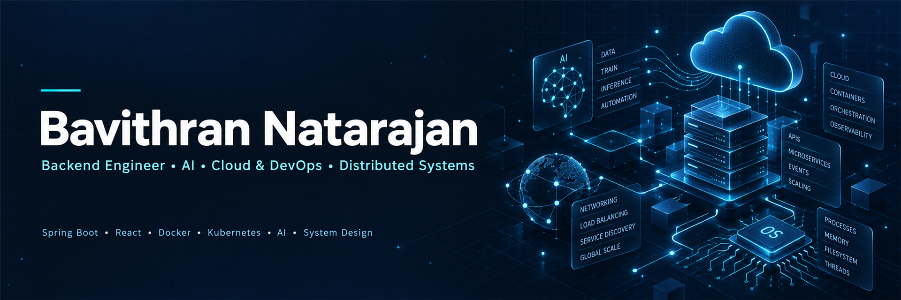

<div align="center">

<a href="https://github.com/Bavithran100">
  
</a>

<h1>Bavithran Natarajan</h1>


<br />

<a href="https://github.com/Bavithran100?tab=followers"></a>


</div>

## Engineering profile

Pre-final year **B.E. Electronics & Communication Engineering** student building toward a career in software, backend, full-stack, and AI engineering.

I recently completed a research internship at **CSIR – Central Scientific Instruments Organisation (CSIO)**. I am drawn to the layers beneath an application: operating systems, networks, cloud infrastructure, and the distributed systems that make software dependable.

### Current direction

```text
focus       backend systems · AI engineering
exploring   system design · cloud · LLMs
building    production-ready applications
principle   understand the whole system
```

## Research / CSIR–CSIO

<details open>
<summary><b>Research internship · domains & technologies</b></summary>

<br />

Computer Vision · Deep Learning · Machine Learning · High Performance Computing · Image Processing · Object Detection · Embedded AI · Sensor Integration

<sub>Research details remain private; this is a high-level view of the technical domains involved.</sub>

</details>

## Selected work

### ProctorX

<sub>Online Examination & AI Proctoring Platform</sub>

Secure examination workflows with AI-assisted question generation, role-based access, live proctoring, and code execution.

`React` `Spring Boot` `Docker` `MySQL` `Redis` `Judge0`

<a href="https://github.com/Bavithran100/ProctorXFrontend"></a>

### Health Consultation Platform

<sub>Real-time healthcare consultation experience</sub>

A secure doctor–patient platform designed around live video consultation and real-time signalling.

`Spring Boot` `MySQL` `Thymeleaf` `WebRTC` `WebSocket` `Spring Security` `STUN/TURN`

<a href="https://github.com/Bavithran100/Online-Meeting-App"></a>

### Maritime Thermal Object Detection

<sub>Computer vision research project</sub>

Thermal-imaging object detection and tracking pipeline, developed with performance-conscious computation in mind.

`YOLO` `BoT-SORT` `Computer Vision` `Thermal Imaging` `High Performance Computing`

### AI-Powered Prosthetic Hand

<sub>Embedded intelligence & control project</sub>

An applied AI and embedded-systems project combining sensor data, classification, and physical prototyping.

`Random Forest` `IMU Sensors` `Embedded Systems` `IoT` `3D Printing`

## Engineering toolkit

<div align="center">

<sub>LANGUAGES</sub><br />


<br /><br />

<sub>APPLICATION ENGINEERING</sub><br />


<br /><br />

<sub>CLOUD, DELIVERY & SYSTEMS</sub><br />


<br /><br />

<sub>AI & COMPUTER VISION</sub><br />


</div>

## Practice signals

<div align="center">

<a href="https://leetcode.com/u/Bavithran777/"></a>

<a href="https://www.geeksforgeeks.org/"></a>

</div>

## GitHub telemetry

<div align="center">

<sub>GITHUB STATISTICS</sub><br />


<br /><br />

<sub>TOP LANGUAGES</sub><br />


<br /><br />

<sub>MOST PRODUCTIVE TIME</sub><br />


<br /><br />

<sub>CONTRIBUTION GRAPH</sub><br />


</div>

## Engineering philosophy

> I enjoy understanding software beyond application code—how operating systems, networks, cloud infrastructure, and distributed components work together. My goal is to design scalable, dependable software that is ready for production.

<div align="center">

<a href="https://bavithran.vercel.app"></a>
<a href="https://www.linkedin.com/in/bavithran-n-04b74b333/"></a>
<a href="mailto:bavithrannatarajan@gmail.com"></a>
<a href="https://github.com/Bavithran100"></a>

<br /><br />

<sub>Designing systems with curiosity. Shipping software with intent.</sub>

</div>
